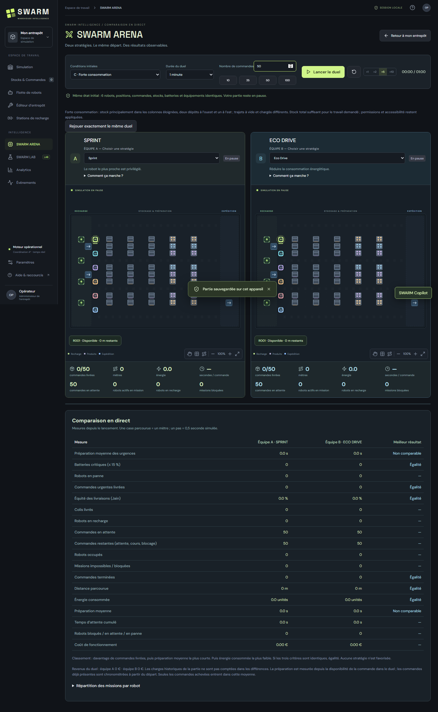
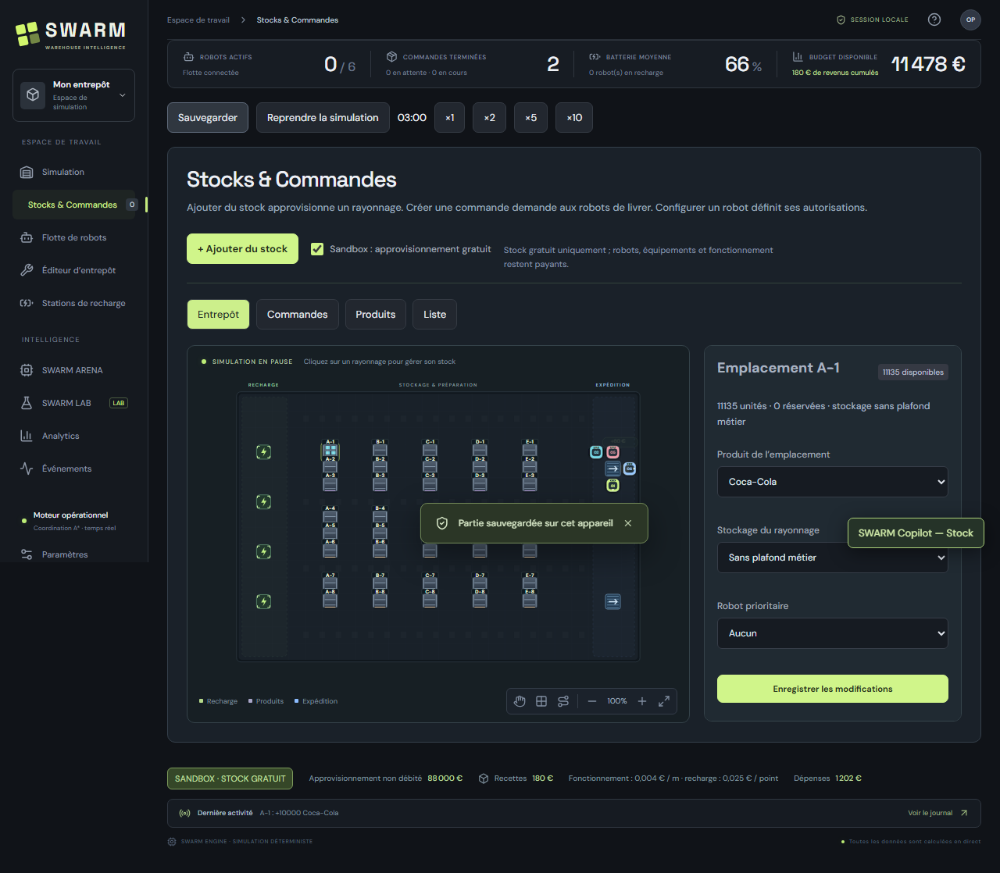
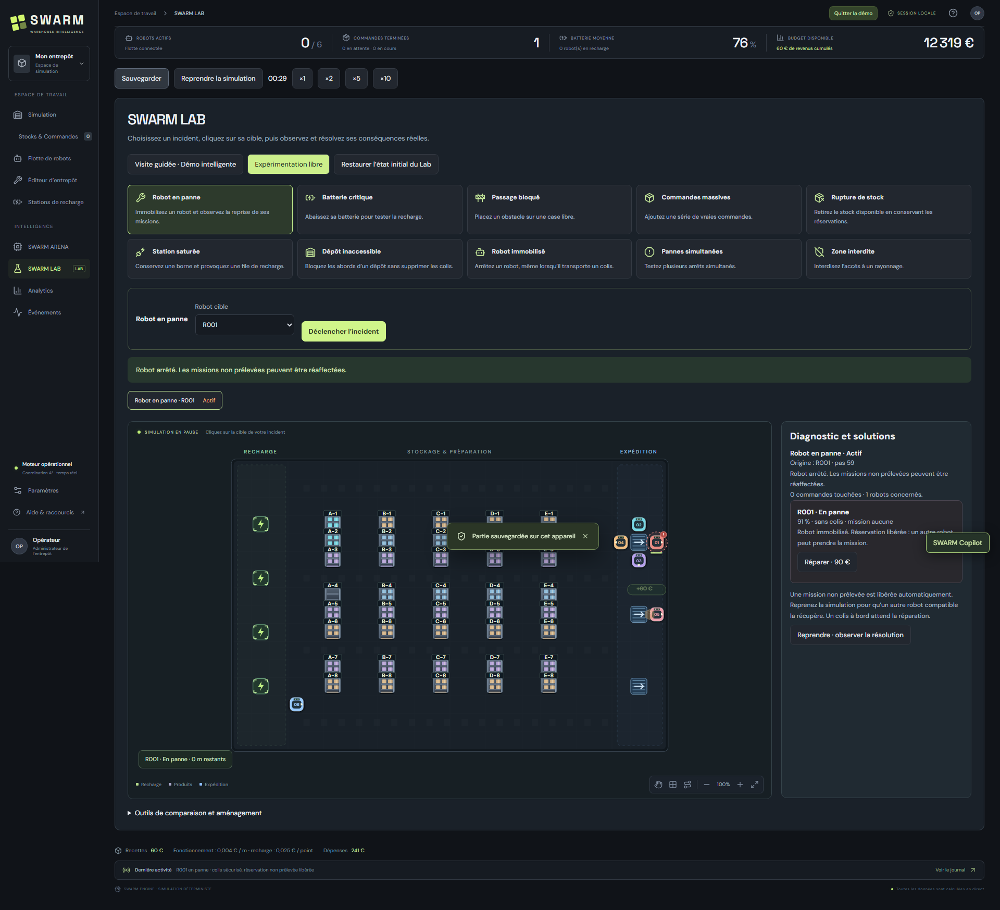

# SWARM — Warehouse Intelligence

**Simuler, piloter et comparer un entrepôt de robots autonomes.**

SWARM est un prototype interactif développé en **React et TypeScript**. Il associe une simulation d’entrepôt, une gestion des produits et commandes, un laboratoire d’incidents et un environnement de comparaison d’algorithmes. Les robots se déplacent sur une grille, prélèvent des unités réelles, les livrent aux dépôts et rechargent leur batterie.

Le projet s’adresse à une présentation universitaire ou à un portfolio : les décisions, mouvements, contraintes et résultats sont observables dans l’interface. Il fonctionne localement dans le navigateur, sans compte, backend ni service payant.



## Problématique et objectifs

Dans un entrepôt automatisé, la proximité du stock ne suffit pas à choisir un robot : il faut aussi considérer les autorisations, les urgences, l’autonomie et la charge de travail. SWARM permet d’explorer ces compromis avec un moteur déterministe et des scénarios reproductibles.

Les objectifs sont de :

- visualiser la navigation et la coordination d’une flotte autonome ;
- gérer des stocks, réservations et livraisons cohérents ;
- observer les effets d’un obstacle, d’une panne ou d’un manque de marchandises ;
- comparer des règles d’affectation sur les mêmes conditions initiales ;
- présenter des indicateurs calculés par la simulation, sans résultats prédéfinis.

## Fonctionnalités

### Simulation de l’entrepôt

La carte interactive représente les rayonnages, dépôts, bornes et obstacles. Elle affiche les robots, leurs itinéraires, les colis et des explications de leurs décisions. Pause, vitesses ×1/×2/×5/×10, caméra, zoom et vue immersive permettent d’observer les missions.

La navigation utilise **A*** sur une grille de 24 × 16 cases. Les robots contournent les obstacles, recalculent les trajets après modification et coordonnent leurs déplacements pour éviter les collisions et échanges directs de cases. Une unité est transportée par trajet.

### Robots, batteries et équipements

La flotte permet de consulter l’état, la batterie et les missions des robots, puis de régler leurs autorisations par produit ou emplacement et leurs priorités. Des actions permettent la recharge, la panne, la réparation payante en monnaie fictive, la suspension et la réactivation.

L’éditeur place rayonnages, dépôts, stations de recharge et obstacles sur des cases libres. Les équipements occupés ou référencés par des missions sont protégés contre les suppressions incohérentes. Les stations affichent la disponibilité des bornes et les robots en recharge.

### Produits, stocks et commandes

Une **nouvelle partie normale démarre sans stock, sans commande et sans revenu**, avec six robots disponibles. Une sauvegarde existante est restaurée sans être vidée automatiquement.

Le catalogue permet de créer des produits avec nom, SKU, valeur, couleur et encombrement. Créer un produit ne crée aucune marchandise. **+ Ajouter du stock** propose un placement automatique ou manuel sur la carte, avec aperçu des emplacements et du coût avant confirmation.

Le placement automatique privilégie les rayonnages du même produit, puis les emplacements vides compatibles. Il peut répartir une quantité entre plusieurs capacités finies. Les stocks de 100, 1 000 ou 10 000 unités restent des quantités numériques ; l’application ne crée pas un objet graphique par marchandise.

Les commandes peuvent choisir automatiquement ou imposer la source, le robot et le dépôt. La validation explique les problèmes de stock, permission, batterie ou accessibilité. Les réservations protègent les marchandises ; la recette est comptabilisée à la livraison complète.

Le panneau d’un rayonnage sépare l’enregistrement de ses paramètres de l’ajout/retrait de stock. Le **Sandbox facultatif** rend uniquement l’approvisionnement gratuit ; robots, équipements, réparations et fonctionnement restent payants. La comptabilité distingue les dépenses réelles et le coût non débité.



### SWARM ARENA

Deux moteurs indépendants reçoivent le même instantané : robots, positions, batteries, stocks, commandes, priorités, permissions et infrastructures. Ils avancent avec les mêmes pas de temps. Les stratégies des équipes A et B sont sélectionnables indépendamment, y compris deux fois la même stratégie.

| Stratégie | Principe réel |
| --- | --- |
| **Sprint** | Minimiser la distance initiale jusqu’au prélèvement |
| **Smart Balance** | Combiner distance et batterie restante |
| **Eco Drive** | Minimiser l’énergie estimée du trajet à vide puis chargé jusqu’au dépôt |
| **Priority First** | Traiter les commandes urgentes avant les normales et basses |
| **Battery Guardian** | Considérer mission, retour vers une borne et réserve d’autonomie |
| **Fleet Fairness** | Tenir compte des affectations, du temps en mission et de la distance déjà parcourue |

Quatre scénarios mettent l’accent sur les batteries déséquilibrées, les urgences, les longs déplacements ou la répartition de la flotte. Le duel accepte de 1 à 200 commandes et une durée de 1, 2, 5 ou 10 minutes simulées. Les paramètres sont verrouillés jusqu’à la fin ou une réinitialisation.

Les cartes montrent les livraisons, attentes, temps de préparation, distance, énergie, robots actifs/en recharge et blocages. Le rapport ajoute les urgences, batteries critiques et la répartition par robot. Le classement compare commandes complètes, préparation moyenne, puis énergie ; une égalité est acceptée. **Rejouer exactement le même duel** réutilise les mêmes conditions.

Aucune stratégie ne gagne automatiquement : les estimations ne prédisent pas la congestion future. Les formules et résultats mesurés sont détaillés dans [ARENA.md](ARENA.md).

### SWARM LAB

Le laboratoire propose une visite guidée et dix incidents paramétrables : panne, passage bloqué, rupture de stock, pic de commandes, batterie critique, problèmes de bornes, accès au stock ou au dépôt, notamment. Les incidents modifient le vrai moteur et disposent de diagnostics et solutions ciblés.

L’historique distingue incidents actifs et résolus. La restauration de l’état initial du Lab permet de revenir à l’instantané conservé en mémoire. Les solutions payantes sont débitées réellement dans l’économie fictive.



### SWARM Copilot

L’assistant local comprend des **intentions françaises prédéfinies**, affiche un aperçu puis demande confirmation avant une modification. Il partage les services métier des formulaires et revalide les contraintes lors de l’exécution.

Exemples pris en charge :

- « Crée Eau et ajoute 1 000 unités dans un rayonnage libre. »
- « Ajoute 20 Fanta dans un emplacement libre. »
- « Dans quelle case se trouve le Coca-Cola ? »
- « Crée une commande urgente de 5 Coca-Cola depuis A-1. »
- « R003 travaille seulement sur A-1 et A-2. »
- « Envoie R001 se recharger. »

Ce Copilot utilise un parseur local, **sans LLM ni API externe**. Une instruction inconnue ou ambiguë ne modifie pas la partie.

### Analytics, événements et sauvegarde

Analytics présente les mesures et l’historique du moteur. Le journal d’événements explique opérations, incidents et affectations. Budget, dépenses et recettes utilisent une monnaie fictive.

La sauvegarde est **manuelle, locale et unique** dans le navigateur. Un rechargement restaure la dernière sauvegarde en pause. Les anciens formats compatibles sont migrés ; une sauvegarde incohérente est rejetée avec un message. Sauvegarder une démonstration remplace volontairement ce même emplacement.

## Technologies et architecture

| Élément | Technologie / rôle |
| --- | --- |
| Interface | React 19, TypeScript, CSS, SVG interactif |
| Outils de développement | Vite 7, npm et fichier de verrouillage des dépendances |
| Moteur | TypeScript déterministe, grille, A*, missions, batteries, stocks et économie |
| Stratégies Arena | Interface commune d’ordre, admissibilité et score ; copies indépendantes |
| Assistant | Parseur d’intentions et opérations métier partagés |
| Persistance | Instantanés JSON validés dans `localStorage` |
| Tests métier | Vitest |
| Tests navigateur | Playwright avec Chromium |
| Qualité | TypeScript strict, ESLint et compilation de production |

Les règles physiques sont communes. Les nouvelles stratégies sont activées sur les copies de l’Arena ; la simulation principale conserve son ordonnanceur historique. Les opérations composées de stock utilisent une validation sur copie avant application. Voir [ARCHITECTURE.md](ARCHITECTURE.md).

### Organisation du dépôt

```text
src/
  engine.ts, pathfinding.ts        Moteur et navigation
  App.tsx, Warehouse.tsx           Application et carte interactive
  Management.tsx, SupplyForm.tsx   Catalogue, stocks et commandes
  FleetMap.tsx, RobotInspector.tsx Flotte et inspection
  supply.ts, operations.ts         Services métier d’approvisionnement
  arena.ts, duel.ts, DuelView.tsx  Scénarios et comparaison
  arenaStrategies.ts              Six stratégies de coordination
  LabView.tsx, labSession.ts       Laboratoire et restauration
  copilot*.ts*, telemetry.ts       Assistant, décisions et signaux
  *.test.ts                       Tests unitaires et d’intégration
tests/                           Parcours Playwright
scripts/                         Audits navigateur et benchmarks
artifacts/                       Captures vérifiées et mesures de référence
```

Les configurations Vite, TypeScript, ESLint, Vitest et Playwright se trouvent à la racine. `package-lock.json` permet une installation reproductible.

## Prérequis

- **Node.js 20.19+ ou 22.12+**, compatible avec Vite 7.
- **npm**, fourni avec Node.js.
- Git pour cloner le dépôt.
- Un navigateur moderne ; Chromium Playwright pour les tests E2E.

Aucune clé API ni fichier `.env` n’est nécessaire.

## Installation et lancement local

```powershell
git clone https://github.com/ThileepanEdvin/SWARM-Warehouse-Intelligence.git
cd SWARM-Warehouse-Intelligence
npm ci
npm run dev
```

Ouvrir l’adresse indiquée par Vite, généralement **http://127.0.0.1:5173/**. Le serveur écoute sur l’interface locale. Arrêter le serveur avec `Ctrl+C`.

Pour un dossier déjà cloné, exécuter `npm ci` puis `npm run dev` depuis sa racine.

### Compilation de production

```powershell
npm run build
```

Le résultat est généré dans `dist/`, exclu de Git. Cette commande compile le projet sans le déployer.

## Vérifications techniques

Les scripts suivants sont définis dans `package.json` :

```powershell
npm run typecheck
npm run lint
npm test
npm run build
npx playwright install chromium
npm run test:e2e -- --workers=3
```

Vitest exécute les tests unitaires et d’intégration du moteur. Playwright démarre son propre serveur local sur **4173**. Exécuter une seule suite Playwright à la fois ; trois workers limitent la charge de Chromium sous Windows.

Les résultats exécutés et limites sont documentés dans [VALIDATION.md](VALIDATION.md). Les captures de `artifacts/` proviennent de parcours réels ; elles représentent des scénarios de référence, pas nécessairement la partie vide au premier lancement.

Pour mesurer les scénarios comparatifs sans interface :

```powershell
node scripts/arena-benchmark.mjs
```

Les résultats sont enregistrés dans `artifacts/arena-benchmarks.json`. Pour les audits navigateur, lancer d’abord `npm run dev`, puis `node scripts/audit-browser.mjs` ou `node scripts/audit-arena-browser.mjs` dans un autre terminal.

Un contrôle local facultatif des signatures de secrets et de l’historique Git est disponible avec Python 3 : `python scripts/audit-release.py`. Il n’affiche pas les valeurs détectées ; ce contrôle ne constitue pas une garantie absolue contre tout secret inconnu.

## Scénarios de démonstration

### Premières marchandises et livraisons

1. Créer une nouvelle partie vide depuis Paramètres après avoir sauvegardé la progression à conserver.
2. Stocks & Commandes → Produits : créer Coca-Cola, SKU `COCA`, valeur 12.
3. **+ Ajouter du stock** : ajouter 100 unités automatiquement, puis 50 manuellement dans A-1.
4. Créer une commande automatique de 10 unités ; reprendre et choisir ×10.
5. À la livraison complète : stock 140 et recette 120 €, sans débit supplémentaire d’approvisionnement.
6. Sauvegarder, recharger et vérifier l’état restauré en pause.

### Présentation guidée

**Paramètres → Préparer la démonstration UX** conserve la partie en mémoire et prépare un scénario en pause. Suivre les six étapes de [DEMONSTRATION.md](DEMONSTRATION.md) : carte, stock automatique, recherche, autorisations, livraison et incident. **Quitter la démo** restaure la partie conservée. La sauvegarde manuelle reste distincte.

### Comparaisons pour l’oral

- **Sprint / Priority First**, scénario B, 100 commandes, 1 minute : effet mesurable sur les urgences.
- **Sprint / Battery Guardian**, scénario A, 50 commandes, 2 minutes : autonomie et productivité.
- **Sprint / Eco Drive**, scénario C, 50 commandes, 2 minutes : estimation énergétique face à la congestion.

Voir [ARENA.md](ARENA.md) pour les mesures de référence et leur interprétation. Les résultats identiques entre stratégies sont également acceptés.

## Limites du prototype

- Carte fixe de 24 × 16 cases, jusqu’à 24 robots, 200 commandes ouvertes, 2 000 commandes archivées et 100 produits.
- Garde-fous numériques : 1 milliard d’unités par rayonnage/ajout, 1 million d’unités par commande ; les anciennes capacités finies restent respectées.
- Une unité par trajet : une commande volumineuse nécessite du temps et éventuellement des recharges.
- Coordination locale ; un passage totalement fermé ou une congestion persistante peut demander une intervention.
- Estimations énergétiques statiques ; aucune stratégie ne garantit le meilleur résultat pour toutes les charges.
- Les permissions contrôlent le prélèvement, pas la circulation dans les couloirs.
- Sauvegarde manuelle unique ; duels, copies temporaires et historique d’incidents du Lab ne persistent pas après rechargement.
- Aucun backend, compte utilisateur, synchronisation multi-utilisateur ou traitement autonome hors onglet.
- Copilot limité aux intentions prévues par son parseur.

## Documentation

- [Architecture](ARCHITECTURE.md)
- [Guide Arena, stratégies et résultats mesurés](ARENA.md)
- [Démonstration pas à pas](DEMONSTRATION.md)
- [Validation technique](VALIDATION.md)
- [Historique des évolutions](CHANGELOG.md)

Les fichiers générés, dépendances, configurations locales, clés privées et fichiers temporaires sont exclus par `.gitignore`. L’historique Git existant et ses points de restauration sont conservés.
