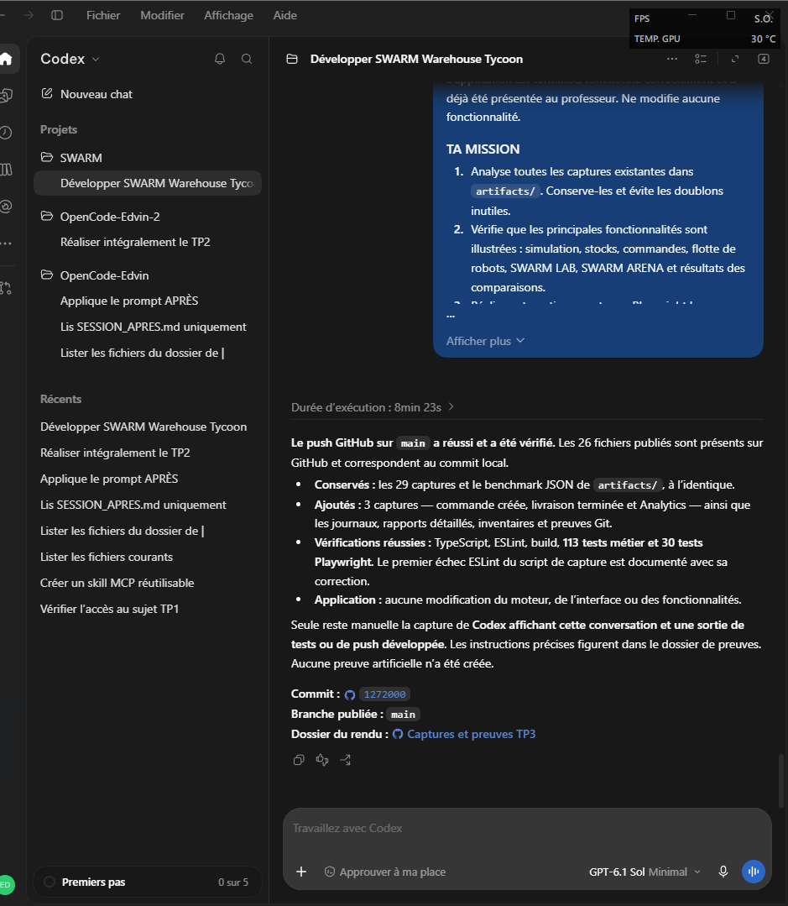

# Preuves du rendu TP3 SWARM

Collecte du 9 octobre 2026 sur le code publié `855c5cf1b8ff3f7622bd27579a198b0ce8411791`. Aucun moteur, composant d’interface, fonctionnalité ou test applicatif n’a été modifié. Les nouvelles captures utilisent Chromium et les interactions réelles de Playwright, dans une session locale isolée.

## Nouvelles captures

| Fichier | Ce qu’il démontre |
| --- | --- |
| [commandes-creees.png](application/commandes-creees.png) | Commande réelle de 10 Coca-Cola, créée avec 100 unités en stock, avant exécution. |
| [commandes-livrees.png](application/commandes-livrees.png) | Commande terminée à 10/10, stock restant 90, revenu 120 €. |
| [analytics-livraisons.png](application/analytics-livraisons.png) | Tableau Analytics après cette livraison réelle. |
| [scenario-commandes.json](application/scenario-commandes.json) | États sauvegardés avant/après, affectations de robots, version Chromium, date, dimensions et absence d’erreur JavaScript. |

Le scénario est reproductible avec `npm run dev -- --port 5173`, puis `node captures/outils/capturer-commandes.mjs`. Il crée un produit, approvisionne 100 unités, commande 10 unités et attend leur livraison par le moteur existant. Il n’injecte aucune sauvegarde. Ces données sont un scénario de démonstration, pas des données de production.

## Anciennes preuves conservées intégralement

Les 29 PNG et le JSON de benchmark dans `artifacts/` ont été examinés. Aucun fichier n’a un SHA-256 identique à un autre. Les vues proches sont conservées car elles montrent des résolutions, phases ou scénarios distincts. Les captures produites de nouveau par les tests sont remplacées par leurs originaux Git avant publication afin de préserver les preuves précédentes.

L’[inventaire complet](inventaire-artifacts.json) fournit taille, dimensions des PNG et SHA-256 avant cette collecte. Le [contrôle de conservation](conservation-artifacts.json) vérifie leur identité après les tests.

| Capture conservée | Fonction ou scénario illustré |
| --- | --- |
| [arena-benchmarks.json](../artifacts/arena-benchmarks.json) | Résultats détaillés des benchmarks Arena précédemment enregistrés ; aucune nouvelle exécution prétendue. |
| [swarm-arena-50.png](../artifacts/swarm-arena-50.png) | SWARM ARENA : configuration, duel ou disposition responsive. |
| [swarm-arena-advanced-1280.png](../artifacts/swarm-arena-advanced-1280.png) | SWARM ARENA : configuration, duel ou disposition responsive. |
| [swarm-arena-advanced-1440.png](../artifacts/swarm-arena-advanced-1440.png) | SWARM ARENA : configuration, duel ou disposition responsive. |
| [swarm-arena-advanced-390.png](../artifacts/swarm-arena-advanced-390.png) | SWARM ARENA : configuration, duel ou disposition responsive. |
| [swarm-arena-advanced-report.png](../artifacts/swarm-arena-advanced-report.png) | Résultats et comparaison des stratégies Arena. |
| [swarm-desktop.png](../artifacts/swarm-desktop.png) | Simulation de l’entrepôt ; variante desktop ou mobile. |
| [swarm-duel-live.png](../artifacts/swarm-duel-live.png) | SWARM ARENA : configuration, duel ou disposition responsive. |
| [swarm-duel-mobile.png](../artifacts/swarm-duel-mobile.png) | SWARM ARENA : configuration, duel ou disposition responsive. |
| [swarm-duel-report.png](../artifacts/swarm-duel-report.png) | Résultats et comparaison des stratégies Arena. |
| [swarm-fleet-mobile.png](../artifacts/swarm-fleet-mobile.png) | Flotte de robots et gestion de leurs propriétés ; variante mobile ou carte selon le nom. |
| [swarm-fleet.png](../artifacts/swarm-fleet.png) | Flotte de robots et gestion de leurs propriétés ; variante mobile ou carte selon le nom. |
| [swarm-immersive.png](../artifacts/swarm-immersive.png) | Simulation en affichage immersif. |
| [swarm-intelligence.png](../artifacts/swarm-intelligence.png) | Démonstration intelligente de la simulation. |
| [swarm-inventory.png](../artifacts/swarm-inventory.png) | Gestion des stocks, emplacement et carte interactive ; résolution indiquée dans le nom. |
| [swarm-lab.png](../artifacts/swarm-lab.png) | SWARM LAB : incident, réparation ou interface responsive. |
| [swarm-mobile.png](../artifacts/swarm-mobile.png) | Simulation de l’entrepôt ; variante desktop ou mobile. |
| [swarm-reroute.png](../artifacts/swarm-reroute.png) | Simulation : obstacle et recalcul de trajet. |
| [swarm-supply-large-stock.png](../artifacts/swarm-supply-large-stock.png) | Approvisionnement de grands volumes et stock final. |
| [swarm-supply-mobile.png](../artifacts/swarm-supply-mobile.png) | Approvisionnement et création de produit sur mobile. |
| [swarm-supply-validation.png](../artifacts/swarm-supply-validation.png) | Approvisionnement : refus des quantités invalides. |
| [swarm-ux-fleet-1280.png](../artifacts/swarm-ux-fleet-1280.png) | Flotte de robots et gestion de leurs propriétés ; variante mobile ou carte selon le nom. |
| [swarm-ux-fleet-390.png](../artifacts/swarm-ux-fleet-390.png) | Flotte de robots et gestion de leurs propriétés ; variante mobile ou carte selon le nom. |
| [swarm-ux-fleet-map.png](../artifacts/swarm-ux-fleet-map.png) | Flotte de robots et gestion de leurs propriétés ; variante mobile ou carte selon le nom. |
| [swarm-ux-lab-1280.png](../artifacts/swarm-ux-lab-1280.png) | SWARM LAB : incident, réparation ou interface responsive. |
| [swarm-ux-lab-390.png](../artifacts/swarm-ux-lab-390.png) | SWARM LAB : incident, réparation ou interface responsive. |
| [swarm-ux-lab-incident.png](../artifacts/swarm-ux-lab-incident.png) | SWARM LAB : incident, réparation ou interface responsive. |
| [swarm-ux-stock-1280.png](../artifacts/swarm-ux-stock-1280.png) | Gestion des stocks, emplacement et carte interactive ; résolution indiquée dans le nom. |
| [swarm-ux-stock-390.png](../artifacts/swarm-ux-stock-390.png) | Gestion des stocks, emplacement et carte interactive ; résolution indiquée dans le nom. |
| [swarm-ux-stock-map.png](../artifacts/swarm-ux-stock-map.png) | Gestion des stocks, emplacement et carte interactive ; résolution indiquée dans le nom. |

## Vérifications réellement exécutées

Les fichiers `tests/*-execution.json` donnent la commande, les dates UTC, la durée et le code de retour. Les `.txt` sont les sorties brutes des commandes, pas des captures reconstituées.

| Contrôle | Journal | Résultat détaillé |
| --- | --- | --- |
| TypeScript (`tsc --noEmit`) | [typecheck.txt](tests/typecheck.txt) | [Exécution](tests/typecheck-execution.json) |
| ESLint | [eslint.txt](tests/eslint.txt) | [Exécution](tests/eslint-execution.json) |
| Build TypeScript + Vite | [build.txt](tests/build.txt) | [Exécution](tests/build-execution.json) |
| Tests métier Vitest | [vitest.txt](tests/vitest.txt) | [Rapport JSON](tests/vitest-results.json) |
| Tests navigateur Playwright / Chromium | [playwright.txt](tests/playwright.txt) | [Rapport JSON](tests/playwright-results.json) |

Un premier passage ESLint a signalé `localStorage` non déclaré dans le nouveau script de collecte, exécuté dans le navigateur. La déclaration de contexte a été corrigée uniquement dans ce script ; [journal initial](tests/eslint-premiere-execution.txt) et [code de retour initial](tests/eslint-premiere-execution.json) conservés. La relance ESLint fait foi pour le résultat final. Le collecteur a aussi rencontré un problème d’affichage Unicode de sa sortie PowerShell après enregistrement de certains journaux ; les codes de retour ci-dessus sont ceux des commandes réelles, enregistrés avant l’affichage. Son encodage de sortie a été corrigé.

Reproduction Windows : `python -X utf8 captures/outils/collect-validation.py typecheck` (puis `eslint`, `build`, `vitest`, `playwright`). Dépendances nécessaires : `npm ci` et Chromium Playwright installé. Le collecteur ne modifie pas le code applicatif. Attention : la suite navigateur existante écrit ses captures dans `artifacts/` ; conserver les originaux avant de la relancer.

## Codex, outils et limites des preuves

L’[historique Git réel](codex/historique-git.txt) contient trois commits antérieurs dont l’auteur déclaré est `Codex`. C’est une preuve de métadonnées Git, pas une capture de l’interface, ni une preuve de modèle, de prompts ou d’agents particuliers. Les journaux et scripts fournis attestent les commandes et les interactions exécutées pour cette collecte : Git, npm, TypeScript, ESLint, Vite, Vitest et Playwright/Chromium. Aucune preuve d’un autre outil n’est inventée.

La capture de la fenêtre Codex et du terminal natif n’est pas accessible automatiquement avec les outils de cette session texte. Les journaux authentiques remplacent les captures du terminal pour les vérifications techniques.

**Capture Codex ajoutée manuellement et vérifiée :** [codex-validation.png](codex/codex-validation.png) montre l’interface Codex, le projet SWARM, une partie de la demande de finalisation et le compte rendu du précédent push sur `main` (commit `1272000`). L’image a été fournie par l’utilisateur, puis contrôlée visuellement : son contenu est lisible. Elle montre la conversation et son compte rendu, sans sortie d’outil développée ; les preuves détaillées des commandes et des tests restent les journaux authentiques référencés ci-dessus. Aucune capture Codex n’a été générée ou reconstituée. Aucune capture manuelle de l’application n’est nécessaire.

## Publication et confidentialité

Le `.gitignore` existant exclut dépendances, builds, caches, sauvegardes locales et formats habituels de secrets (`.env*`, clés privées, certificats, credentials, dossiers `.aws`, `.codex`, `.agents`). Seuls le README et les preuves de ce dossier sont ajoutés au commit. Les journaux peuvent contenir le chemin local du projet, sans identifiant d’authentification. Voir [audit avant publication](audit-publication.json).

Résultats finaux de la collecte : **TypeScript, ESLint et build réussis (code 0), 113/113 tests métier et 30/30 tests Playwright réussis**, sans test ignoré ou en échec.
